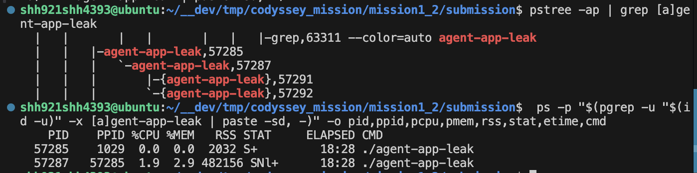
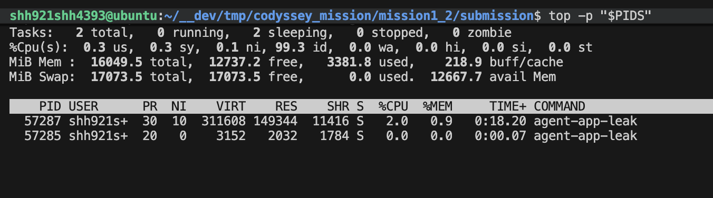
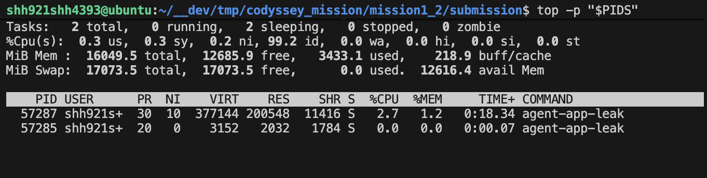

# [Bug] CPU 지연 - CPU 부하가 안전 임계치를 넘으면 CpuWorker 가드가 에이전트를 종료함

## 1. Description (현상 설명)

CPU 케이스는 데드락 경로를 피하고 CPU 동작만 분리하기 위해 `MULTI_THREAD_ENABLE=false`로 재현했다. 에이전트는 정상적으로 시작했고 `CpuWorker`가 실행됐다. 두 구성을 비교했다:

- 이전: `CPU_MAX_OCCUPY=100`
- 이후: `CPU_MAX_OCCUPY=10`

`CPU_MAX_OCCUPY=100`에서는 `CpuWorker` 부하가 안전 임계치를 넘어 프로세스가 종료됐다. `CPU_MAX_OCCUPY=10`에서는 작업자가 반복해서 `10.00%`에 도달한 뒤 냉각으로 들어가 위반 임계치를 넘지 않았다.

## 2. Evidence & Logs (증거 자료)

원본 증거 (재개편 경로):

- [submission/evidence/cpu/cpu-max-100/stdout.log](submission/evidence/cpu/cpu-max-100/stdout.log)
- [submission/evidence/cpu/cpu-max-100/agent_app.log](submission/evidence/cpu/cpu-max-100/agent_app.log)
- [submission/evidence/cpu/cpu-max-100/monitor.log](submission/evidence/cpu/cpu-max-100/monitor.log)
- [submission/evidence/cpu/cpu-max-100/monitor.stdout](submission/evidence/cpu/cpu-max-100/monitor.stdout)
- [submission/evidence/cpu/cpu-max-100/ps_top.log](submission/evidence/cpu/cpu-max-100/ps_top.log)
- [submission/evidence/cpu/cpu-max-10/stdout.log](submission/evidence/cpu/cpu-max-10/stdout.log)
- [submission/evidence/cpu/cpu-max-10/agent_app.log](submission/evidence/cpu/cpu-max-10/agent_app.log)
- [submission/evidence/cpu/cpu-max-10/monitor.log](submission/evidence/cpu/cpu-max-10/monitor.log)
- [submission/evidence/cpu/cpu-max-10/monitor.stdout](submission/evidence/cpu/cpu-max-10/monitor.stdout)
- [submission/evidence/cpu/cpu-max-10/ps_top.log](submission/evidence/cpu/cpu-max-10/ps_top.log)

스크린샷 (time 연관):

- 2026-05-13 20:21: `ps` 확인 (PID/리소스 스냅샷)



- 2026-05-13 20:22: `top` 실행 전 (CPU load 1.7)



- 2026-05-13 20:22: `top` 실행 후 (CPU load 2.0)



프로그램 로그 발췌:

```text
CPU_MAX_OCCUPY=100:
[CpuWorker] Started. Maximum CPU Limit: 100%
[CpuWorker] Current Load: 47.26%
[CpuWorker] CPU Threshold Violated! (50.739999999999995%).

CPU_MAX_OCCUPY=10:
[CpuWorker] Started. Maximum CPU Limit: 10%
[CpuWorker] Peak reached (10.00%). Starting cooldown...
```

## 3. Root Cause Analysis (원인 분석)

CPU 이슈는 에이전트의 자체 `CpuWorker` 가드가 제어한다. 완화된 `CPU_MAX_OCCUPY=100`은 부하가 약 `50%`를 넘긴 뒤 `CPU Threshold Violated` 로그가 발생하도록 허용했다. 이는 무작위 크래시가 아니라 보호 종료 경로다.

`CPU_MAX_OCCUPY=10`에서는 작업자가 `10.00%`를 피크로 간주하고 냉각에 들어간다. 비교 결과 환경 변수가 작업 부하가 위반 범위로 상승하는지 여부를 바꾸는 것을 보여준다.

## 4. Workaround & Verification (조치 및 검증)

우회 방법:

- 이 테스트 환경에서는 `10`과 같은 보수적인 `CPU_MAX_OCCUPY`를 사용한다.
- CPU 동작을 데드락 동작과 분리할 때는 `MULTI_THREAD_ENABLE=false`를 유지한다.

이전 및 이후:

- `CPU_MAX_OCCUPY=100`: 부하가 `50.73%`까지 올라가 `CPU Threshold Violated`가 발생.
- `CPU_MAX_OCCUPY=10`: 부하가 `10.00%`에 도달한 뒤 관측 구간 동안 위반 로그 없이 냉각.

검증 결과: PASS. `CPU_MAX_OCCUPY`에 따라 CPU 가드 동작이 달라졌고, 표준 Linux 도구로 프로세스 PID를 캡처했다.

## 5. CPU Spike 정밀 분석 (짧은 간격 샘플링)

CPU 급상승 구간은 cron이 아닌 짧은 간격 샘플링으로 관측한다. `monitor.sh`는 1회 실행당 1줄 로그를 남기고, 별도 샘플러가 짧은 간격으로 반복 실행한다. 이후 Python 도구가 ΔCPU/Δt(1차 차분 수치미분)로 급상승 구간을 판정한다.

흐름:

1) 샘플링 로그 수집: [submission/tools/monitor_cpu_sampling.sh](submission/tools/monitor_cpu_sampling.sh)
2) ΔCPU/Δt 분석: [submission/tools/cpu_spike_analyzer.py](submission/tools/cpu_spike_analyzer.py)
3) 산출물: [submission/evidence/cpu/spike/monitor_cpu.log](submission/evidence/cpu/spike/monitor_cpu.log), [submission/evidence/cpu/spike/cpu_spike.csv](submission/evidence/cpu/spike/cpu_spike.csv), [submission/evidence/cpu/spike/cpu_spike.png](submission/evidence/cpu/spike/cpu_spike.png), [submission/evidence/cpu/spike/cpu_spike.md](submission/evidence/cpu/spike/cpu_spike.md)

설명:

- 연속 미분이 아니라 촘촘한 샘플링 기반 1차 차분 수치미분이다.
