# Python 콘솔 퀴즈 게임

## 1. 프로젝트 개요

이 프로젝트는 **Python 기초 상식**을 주제로 한 콘솔 퀴즈 게임이다.  
Python 기본 문법, 클래스(객체 지향), 파일 입출력, Git/GitHub 사용을 한 번에 연습하기 위해 만들었다.

이 프로젝트를 통해 아래를 구현했다.

- 메뉴 기반 콘솔 프로그램
- `Quiz`, `QuizGame` 클래스를 통한 역할 분리
- `state.json`을 이용한 퀴즈/점수 영속성 구현
- 잘못된 입력 및 예외 상황 처리
- Git 브랜치, 병합, `clone`, `pull` 실습 기록
- README 기반 검증 문서화

### 터미널 작업 시작 위치

프로젝트 작업은 아래 경로에서 시작했다.

```zsh
cd ~/dev
```

실행 결과:

```text
/Users/shh921shh4393/dev
```

```zsh
mkdir -p python-quiz-game-mission
```

실행 결과:

```text
(출력 없음)
```

```zsh
cd python-quiz-game-mission
```

실행 결과:

```text
(출력 없음)
```

```zsh
pwd
```

실행 결과:

```text
/Users/shh921shh4393/dev/python-quiz-game-mission
```

### 초기 프로젝트 생성 로그

기본 폴더와 파일을 만든 뒤 현재 구조를 확인했다.

```zsh
mkdir -p docs/screenshots
touch main.py
touch quiz.py
touch quiz_game.py
touch README.md
touch .gitignore
ls -la
```

실행 결과:

```text
total 48
drwxr-xr-x  10 shh921shh4393  shh921shh4393  320 Mar 31 18:14 .
drwxr-xr-x   7 shh921shh4393  shh921shh4393  224 Mar 31 18:13 ..
drwxr-xr-x  13 shh921shh4393  shh921shh4393  416 Mar 31 18:16 .git
-rw-r--r--   1 shh921shh4393  shh921shh4393   30 Mar 31 18:13 .gitignore
drwxr-xr-x   3 shh921shh4393  shh921shh4393   96 Mar 31 18:13 docs
-rw-r--r--   1 shh921shh4393  shh921shh4393   53 Mar 31 18:13 main.py
-rw-r--r--   1 shh921shh4393  shh921shh4393   62 Mar 31 18:13 quiz_game.py
-rw-r--r--   1 shh921shh4393  shh921shh4393   52 Mar 31 18:13 quiz.py
-rw-r--r--   1 shh921shh4393  shh921shh4393  968 Mar 31 18:18 README.md
-rw-r--r--   1 shh921shh4393  shh921shh4393   40 Mar 31 18:13 state.json
```

---

## 2. 퀴즈 주제 선정 이유

퀴즈 주제는 **Python 기초 상식**으로 정했다.

선정 이유는 다음과 같다.

- 이번 과제의 핵심 학습 목표가 Python 기본 문법, 클래스, 파일 저장 구조를 이해하는 것이기 때문이다.
- 프로그램 주제와 학습 주제가 동일하면 문제를 만들고 검증하는 과정이 자연스럽다.
- 사용자가 퀴즈를 풀면서 Python 개념을 같이 복습할 수 있어 과제 목적과 잘 맞는다.

즉, 이 프로젝트는 단순한 게임 구현이 아니라 **Python 학습 내용을 퀴즈 형태로 다시 확인하는 구조**를 의도했다.

---

## 3. 실행 환경

- Python: Python 3.11 이상 기준
- Python 경로: `/usr/bin/python3`
- Git: `git version 2.53.0`
- Shell: `/bin/zsh`
- OS: macOS (Darwin Kernel Version 24.6.0)
- 에디터: VSCode
- 기준 실행 환경: Codyssey2026 README와 동일 기준으로 정리

---

## 4. 실행 방법

### 4-1. 저장소 clone

```zsh
git clone https://github.com/shannonlee-dev/python-quiz-game-mission.git
cd python-quiz-game-mission
```

### 4-2. 프로그램 실행

```zsh
python3 main.py
```

### 4-3. 실행 후 사용 흐름

프로그램을 실행하면 메뉴가 출력된다.

- `1`: 퀴즈 풀기
- `2`: 퀴즈 추가
- `3`: 퀴즈 목록
- `4`: 점수 확인
- `5`: 종료

프로그램은 종료 전 `state.json`에 현재 상태를 저장하며, 다음 실행 시 저장된 퀴즈 목록과 최고 점수를 다시 불러온다.

---

## 5. 기능 목록

- 퀴즈 풀기
  - 저장된 퀴즈를 순서대로 출제
  - 정답 입력 처리
  - 정답/오답 판별
  - 최종 점수 계산 및 출력
- 퀴즈 추가
  - 문제, 선택지 4개, 정답 번호 입력
  - 추가 즉시 파일 저장
- 퀴즈 목록 보기
  - 등록된 전체 퀴즈 질문 목록 출력
  - 퀴즈가 없을 경우 안내 메시지 출력
- 최고 점수 확인
  - 최고 정답 수와 문제 수 기준 점수 출력
  - 아직 플레이 기록이 없으면 안내 메시지 출력
- 상태 저장/불러오기
  - `state.json`에 퀴즈 목록과 최고 점수 저장
  - 재실행 시 자동 복구
- 예외 처리
  - 빈 입력 차단
  - 숫자 변환 실패 차단
  - 허용 범위 밖 입력 차단
  - `KeyboardInterrupt`, `EOFError` 발생 시 저장 후 안전 종료
- 복구 처리
  - `state.json`이 없으면 기본 퀴즈 데이터로 초기화
  - `state.json`이 손상되면 안내 후 기본 데이터로 복구

---

## 6. 프로젝트 구조

```text
python-quiz-game-mission/
├── main.py
├── quiz.py
├── quiz_game.py
├── README.md
├── .gitignore
├── state.json
└── docs/
    └── screenshots/
```

### 구조를 이렇게 나눈 이유

- `main.py`
  - 프로그램 실행 시작점만 담당한다.
  - 메뉴 루프와 기능 호출 흐름을 연결한다.
- `quiz.py`
  - 개별 퀴즈 1개를 표현하는 `Quiz` 클래스를 담는다.
  - 문제, 선택지, 정답, 출력, 정답 판별, 객체-딕셔너리 변환 책임을 가진다.
- `quiz_game.py`
  - 전체 게임 흐름을 관리하는 `QuizGame` 클래스를 담는다.
  - 메뉴, 퀴즈 진행, 추가, 목록, 점수, 저장/불러오기, 입력 검증을 담당한다.
- `state.json`
  - 퀴즈 목록과 최고 점수를 저장하는 상태 파일이다.
- `docs/screenshots`
  - 실행 결과와 검증 증거 스크린샷을 보관한다.
- `.gitignore`
  - 캐시 파일과 macOS 시스템 파일 등 Git 추적이 필요 없는 파일을 제외한다.

현재 프로젝트 루트 구조는 아래와 같다.

```zsh
ls -la
```

실행 결과:

```text
total 64
drwxr-xr-x   5 shh921shh4393  shh921shh4393   160 Mar 31 19:14 __pycache__
drwxr-xr-x  11 shh921shh4393  shh921shh4393   352 Mar 31 19:12 .
drwxr-xr-x   7 shh921shh4393  shh921shh4393   224 Mar 31 18:13 ..
drwxr-xr-x  14 shh921shh4393  shh921shh4393   448 Mar 31 19:20 .git
-rw-r--r--   1 shh921shh4393  shh921shh4393    30 Mar 31 18:13 .gitignore
drwxr-xr-x   3 shh921shh4393  shh921shh4393    96 Mar 31 18:13 docs
-rw-r--r--   1 shh921shh4393  shh921shh4393   556 Mar 31 19:14 main.py
-rw-r--r--   1 shh921shh4393  shh921shh4393  8661 Mar 31 19:14 quiz_game.py
-rw-r--r--   1 shh921shh4393  shh921shh4393   881 Mar 31 18:28 quiz.py
-rw-r--r--   1 shh921shh4393  shh921shh4393  4023 Mar 31 19:00 README.md
-rw-r--r--   1 shh921shh4393  shh921shh4393  1530 Mar 31 19:20 state.json
```

---

## 7. 클래스 설계

## `Quiz`

개별 퀴즈 1개를 표현하는 클래스다.

### 속성
- `question`
- `choices`
- `answer`

### 메서드
- `display(index)`
  - 문제 번호, 질문, 선택지를 출력한다.
- `is_correct(user_answer)`
  - 사용자가 입력한 정답 번호가 맞는지 판별한다.
- `to_dict()`
  - 현재 퀴즈 객체를 JSON 저장용 딕셔너리로 변환한다.
- `from_dict(data)`
  - 딕셔너리 데이터를 다시 `Quiz` 객체로 복원한다.

## `QuizGame`

게임 전체를 관리하는 클래스다.

### 속성
- `quizzes`
- `best_score`
- `best_total_questions`
- `state_path`

### 메서드
- `show_menu()`
- `play_quiz()`
- `add_quiz()`
- `list_quizzes()`
- `show_best_score()`
- `load_state()`
- `save_state()`
- `read_non_empty_text()`
- `read_int_in_range()`
- `safe_exit()`

### 역할 분리 이유

`Quiz`는 **퀴즈 1개**의 정보와 동작을 담당하고,  
`QuizGame`은 **게임 전체 흐름**과 저장 상태를 관리한다.

이렇게 분리하면 개별 문제 로직과 전체 프로그램 로직이 섞이지 않아 코드가 더 읽기 쉽고 수정하기 쉽다.

### 왜 클래스를 사용했는가, 함수만으로 구현할 때와 어떤 차이가 있는가

이 프로젝트에서 클래스를 사용한 이유는 **데이터와 기능을 역할별로 묶기 위해서**다.

#### `Quiz` 클래스를 둔 이유
퀴즈 1개는 아래 3개의 데이터와 그에 연결된 동작을 항상 같이 가진다.

- 문제(`question`)
- 선택지(`choices`)
- 정답(`answer`)

이 3개를 단순 변수나 딕셔너리로만 두면, 출력 로직과 정답 판별 로직이 게임 전체 코드에 흩어지기 쉽다.  
그래서 `Quiz` 클래스에 아래 책임을 모았다.

- 퀴즈 1개의 상태 보관
- 자기 자신 출력(`display`)
- 정답 판별(`is_correct`)
- 저장용 딕셔너리 변환(`to_dict`)
- 파일에서 읽은 데이터 복원(`from_dict`)

즉, `Quiz`는 **퀴즈 1개 단위의 데이터와 동작을 같이 가진 객체**다.

#### `QuizGame` 클래스를 둔 이유
반면 `QuizGame`은 퀴즈 1개가 아니라 **게임 전체 흐름**을 관리한다.

- 메뉴 출력
- 퀴즈 진행
- 퀴즈 추가
- 퀴즈 목록 출력
- 최고 점수 관리
- 파일 저장/불러오기
- 입력 검증
- 안전 종료

즉, `QuizGame`은 **프로그램의 전체 상태와 흐름을 통제하는 관리자 클래스**다.

#### 함수만으로 구현했을 때와의 차이
함수만으로도 구현은 가능하지만, 그 경우 아래 문제가 생기기 쉽다.

1. 퀴즈 1개 데이터와 전체 게임 로직이 한 파일/한 영역에 섞인다.
2. 문제 출력, 정답 판별, 저장 변환 로직이 여러 함수에 흩어진다.
3. 상태를 전역 변수나 여러 인자 전달에 의존하게 되어 수정 범위가 커진다.
4. 기능이 늘어날수록 어떤 함수가 어떤 데이터를 책임지는지 파악하기 어려워진다.

클래스를 사용하면 아래가 쉬워진다.

- `Quiz`는 개별 문제 책임
- `QuizGame`은 전체 게임 책임

이렇게 나누면 요구사항이 바뀌었을 때도 수정 위치를 먼저 좁힐 수 있다.  
예를 들어 정답 판별 규칙이 바뀌면 `Quiz`를 먼저 보고, 저장 흐름이나 메뉴가 바뀌면 `QuizGame`을 먼저 보면 된다.

즉 현재 구조에서는 요구사항이 바뀌면  
**데이터 구조 변경은 `Quiz`, 흐름 변경은 `QuizGame`, 시작 연결은 `main.py`, 저장 규칙 변경은 `load_state/save_state`를 먼저 본다**고 설명할 수 있다.

---

## 8. 데이터 파일 설명

`state.json`은 프로젝트 루트에 위치하며, 퀴즈 목록과 최고 점수를 UTF-8 JSON 형식으로 저장한다.  
프로그램 종료 후 다시 실행해도 추가한 퀴즈와 최고 점수가 유지되도록 하기 위해 사용한다.

### 저장 스키마

```json
{
    "quizzes": [
        {
            "question": "Python의 창시자는 누구인가?",
            "choices": [
                "귀도 반 로섬",
                "리누스 토르발스",
                "제임스 고슬링",
                "비야네 스트롭스트룹"
            ],
            "answer": 1
        }
    ],
    "best_score": 3,
    "best_total_questions": 5
}
```

### 현재 확인된 실제 상태 파일 예시

```zsh
cat state.json
```

실행 결과:

```json
{
    "quizzes": [
        {
            "question": "Python의 창시자는 누구인가?",
            "choices": [
                "귀도 반 로섬",
                "리누스 토르발스",
                "제임스 고슬링",
                "비야네 스트롭스트룹"
            ],
            "answer": 1
        },
        {
            "question": "Python에서 리스트를 만들 때 사용하는 기호는 무엇인가?",
            "choices": [
                "{}",
                "[]",
                "()",
                "<>"
            ],
            "answer": 2
        },
        {
            "question": "조건이 참일 때만 실행 흐름을 나누는 문법은 무엇인가?",
            "choices": [
                "for",
                "while",
                "if",
                "def"
            ],
            "answer": 3
        },
        {
            "question": "문자열을 숫자로 변환할 때 주로 사용하는 함수는 무엇인가?",
            "choices": [
                "str()",
                "list()",
                "int()",
                "dict()"
            ],
            "answer": 3
        },
        {
            "question": "반복 가능한 객체를 순회할 때 자주 사용하는 반복문은 무엇인가?",
            "choices": [
                "if",
                "for",
                "class",
                "try"
            ],
            "answer": 2
        }
    ],
    "best_score": 5,
    "best_total_questions": 5
}
```

### `state.json` 데이터 구조를 현재 형태로 설계한 이유

현재 `state.json`은 아래 3개 필드를 중심으로 설계했다.

- `quizzes`
- `best_score`
- `best_total_questions`

#### 1) `quizzes`를 리스트로 둔 이유
게임에는 퀴즈가 여러 개 존재하므로, 퀴즈 데이터는 **여러 항목을 순서대로 담기 좋은 리스트** 구조가 가장 자연스럽다.

각 퀴즈를 객체 그대로 저장하지 않고 딕셔너리로 변환한 이유는 JSON이 Python 객체를 직접 저장할 수 없기 때문이다.  
그래서 퀴즈 1개는 아래처럼 딕셔너리 구조로 저장했다.

- `question`
- `choices`
- `answer`

이 구조를 선택한 이유는 퀴즈 1개를 복원할 때 필요한 최소 정보가 정확히 이 3개이기 때문이다.

#### 2) `best_score`를 별도 필드로 둔 이유
최고 점수는 퀴즈 목록과 성격이 다르다.  
퀴즈 목록은 문제 데이터이고, 최고 점수는 **게임 기록 상태**다.

그래서 `quizzes` 내부에 섞지 않고 최상위 필드로 분리했다.  
이렇게 하면 프로그램 시작 시 최고 점수를 바로 읽을 수 있고, 퀴즈 목록과 독립적으로 갱신하기도 쉽다.

#### 3) `best_total_questions`를 함께 저장한 이유
최고 점수 숫자만 저장하면 그 점수가 **몇 문제 기준인지 해석이 안 된다.**

예를 들어 `best_score = 4`만 있으면:
- 5문제 중 4개인지
- 10문제 중 4개인지

구분할 수 없다.

그래서 `best_total_questions`를 같이 저장해 아래처럼 설명 가능한 형태로 유지했다.

- 5문제 중 4문제 정답
- 80점

즉, 이 데이터 구조는 **퀴즈 목록 + 최고 점수 상태를 최소 필드로 분리해 저장하고, 프로그램 재실행 시 그대로 복원하기 쉽게 설계한 구조**다.

현재 방식은 학습 과제 규모에서는 충분하지만, 퀴즈가 1000개 이상으로 커지면 아래 한계가 생길 수 있다.

- 프로그램 시작 시 `state.json` 전체를 한 번에 읽고, 저장할 때도 전체를 다시 써야 해서 읽기/쓰기 비용이 커질 수 있다.
- 시작 시 퀴즈 전체를 모두 `Quiz` 객체로 복원하므로 메모리 사용량과 초기 로딩 비용이 커질 수 있다.
- 퀴즈 1개만 추가하거나 최고 점수만 바꿔도 전체 파일을 다시 저장하므로 부분 수정이 비효율적이다.
- JSON 파일 하나에 전체 상태를 몰아두는 방식은 동시 수정이나 충돌에 약하다.
- 나중에 카테고리 검색, 난이도 필터, 최근 기록 조회 같은 기능이 늘어나면 JSON 한 파일 구조는 점점 불편해질 수 있다.

즉, 현재 JSON 방식은 **작은 콘솔 프로그램에서는 단순하고 이해하기 좋지만, 데이터가 커질수록 전체 읽기/전체 쓰기 구조의 성능과 관리 한계가 드러나는 방식**이다.

---

## 9. 상태 저장 및 복구 방식

프로그램은 시작 시 `state.json`을 읽어 퀴즈 목록과 최고 점수를 복구한다.  
파일이 없거나 JSON 구조가 손상된 경우에는 기본 퀴즈 데이터로 다시 초기화하고 즉시 `state.json`을 재생성한다.

### 9-1. 파일이 없을 때 복구

```zsh
rm -f state.json
python3 main.py
```

실행 결과:

```text
state.json 파일이 없어 기본 퀴즈 데이터로 시작합니다.

========================================
        나만의 퀴즈 게임
========================================
1. 퀴즈 풀기
2. 퀴즈 추가
3. 퀴즈 목록
4. 점수 확인
5. 종료
========================================
선택:
```

아래 스크린샷은 `state.json` 파일이 없을 때 기본 퀴즈 데이터로 복구되는 화면이다.

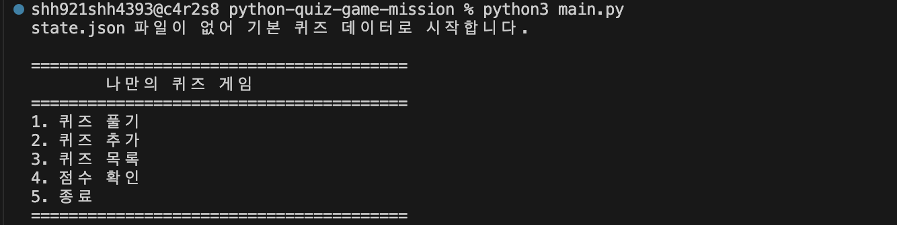

### 9-2. 손상된 JSON 파일 복구

```zsh
echo "{broken json" > state.json
python3 main.py
```

실행 결과:

```text
state.json 파일이 없거나 손상되어 기본 데이터로 복구합니다.
상세 원인: Expecting property name enclosed in double quotes: line 1 column 2 (char 1)

========================================
        나만의 퀴즈 게임
========================================
1. 퀴즈 풀기
2. 퀴즈 추가
3. 퀴즈 목록
4. 점수 확인
5. 종료
========================================
선택: 게임을 종료합니다.
```

복구 후 `state.json`을 다시 확인했다.

```zsh
cat state.json
```

실행 결과:

```json
{
    "quizzes": [
        {
            "question": "Python의 창시자는 누구인가?",
            "choices": [
                "귀도 반 로섬",
                "리누스 토르발스",
                "제임스 고슬링",
                "비야네 스트롭스트룹"
            ],
            "answer": 1
        },
        {
            "question": "Python에서 리스트를 만들 때 사용하는 기호는 무엇인가?",
            "choices": [
                "{}",
                "[]",
                "()",
                "<>"
            ],
            "answer": 2
        },
        {
            "question": "조건이 참일 때만 실행 흐름을 나누는 문법은 무엇인가?",
            "choices": [
                "for",
                "while",
                "if",
                "def"
            ],
            "answer": 3
        },
        {
            "question": "문자열을 숫자로 변환할 때 주로 사용하는 함수는 무엇인가?",
            "choices": [
                "str()",
                "list()",
                "int()",
                "dict()"
            ],
            "answer": 3
        },
        {
            "question": "반복 가능한 객체를 순회할 때 자주 사용하는 반복문은 무엇인가?",
            "choices": [
                "if",
                "for",
                "class",
                "try"
            ],
            "answer": 2
        }
    ],
    "best_score": null,
    "best_total_questions": null
}
```

아래 스크린샷은 손상된 `state.json` 파일이 복구되는 화면이다.

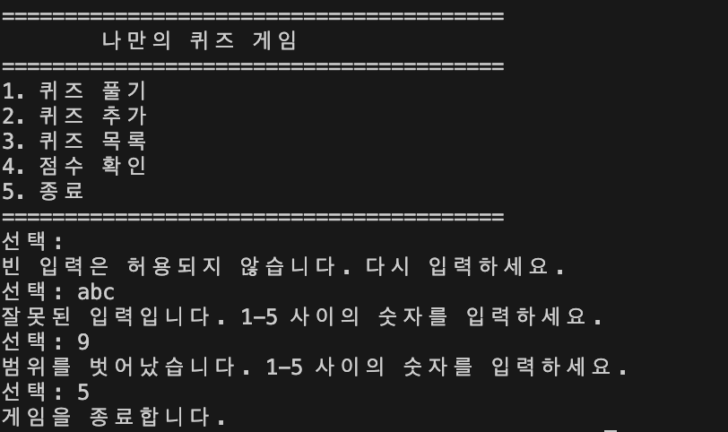

### 9-3. 재실행 후 데이터 유지 확인

프로그램을 다시 실행했을 때 추가한 퀴즈와 최고 점수가 유지되는지도 확인했다.

아래 스크린샷은 재실행 직후 저장된 퀴즈 개수와 최고 점수가 다시 불러와지는 화면이다.

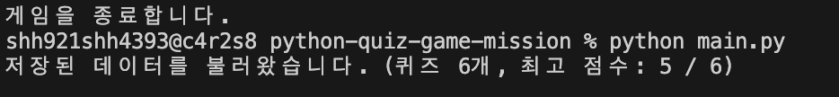

### `state.json` 읽기/쓰기 흐름이 프로그램 안에서 실제로 어떤 순서로 발생하는가

인터뷰에서 이 질문을 받으면 아래 순서로 설명할 수 있다.

#### 프로그램 시작 시 읽기 흐름

1. 사용자가 `python3 main.py`를 실행한다.
2. `main.py`에서 `QuizGame()` 객체를 생성한다.
3. `QuizGame.__init__()`가 실행된다.
4. `__init__()` 안에서 먼저 아래 기본 상태를 준비한다.
   - `self.state_path = Path("state.json")`
   - `self.quizzes = []`
   - `self.best_score = None`
   - `self.best_total_questions = None`
5. 그 직후 `self.load_state()`를 호출한다.
6. `load_state()`에서 먼저 `state.json` 파일 존재 여부를 검사한다.

#### 경우 1. `state.json` 파일이 존재할 때

7. 파일이 있으면 `with open(..., "r", encoding="utf-8")`로 연다.
8. `json.load()`로 JSON 데이터를 읽는다.
9. 최상위 구조가 딕셔너리인지 확인한다.
10. `quizzes`, `best_score`, `best_total_questions` 필드를 꺼낸다.
11. `quizzes`가 리스트인지 확인한다.
12. 리스트 안의 각 퀴즈 딕셔너리를 `Quiz.from_dict()`로 변환한다.
13. 변환된 `Quiz` 객체 리스트를 `self.quizzes`에 저장한다.
14. 최고 점수 관련 값도 `self.best_score`, `self.best_total_questions`에 넣는다.
15. 이 시점에서 프로그램은 **파일에 저장돼 있던 상태를 메모리로 복원한 상태**가 된다.
16. 이후 메뉴가 출력된다.

#### 경우 2. `state.json` 파일이 없을 때

7. 파일이 없으면 첫 실행 상황으로 판단한다.
8. `build_default_quizzes()`로 기본 퀴즈 5개 이상을 만든다.
9. `self.quizzes`에 기본 퀴즈 객체 목록을 넣는다.
10. 최고 점수 관련 값은 `None`으로 둔다.
11. 바로 `self.save_state()`를 호출해 새 `state.json`을 생성한다.
12. 즉, **파일이 없으면 기본 데이터로 메모리를 먼저 채우고, 그 상태를 다시 파일에 기록한다.**

#### 경우 3. `state.json` 파일이 손상되었을 때

7. 파일은 있지만 `json.load()` 또는 구조 검증 단계에서 예외가 날 수 있다.
8. 이때 `try/except`가 예외를 잡는다.
9. 손상 안내 메시지를 출력한다.
10. 기본 퀴즈 데이터로 다시 초기화한다.
11. 최고 점수는 `None`으로 초기화한다.
12. `self.save_state()`를 호출해 정상 JSON 구조로 파일을 덮어쓴다.
13. 즉, **손상 파일은 버리고 기본 상태로 메모리를 재구성한 뒤, 그 상태를 다시 파일에 기록한다.**

#### 프로그램 실행 중 쓰기 흐름

쓰기 흐름은 **상태가 실제로 바뀌는 시점**에 발생한다.

##### 1) 퀴즈 추가 시
1. 사용자가 메뉴에서 `2. 퀴즈 추가`를 선택한다.
2. `QuizGame.add_quiz()`가 실행된다.
3. 문제, 선택지 4개, 정답 번호를 입력받는다.
4. 새 `Quiz` 객체를 만든다.
5. `self.quizzes.append(new_quiz)`로 메모리 상태를 바꾼다.
6. 곧바로 `self.save_state()`를 호출한다.
7. `save_state()`는 현재 `self.quizzes`의 각 `Quiz` 객체를 `to_dict()`로 변환한다.
8. 변환된 리스트와 `best_score`, `best_total_questions`를 하나의 딕셔너리로 만든다.
9. `json.dump(..., ensure_ascii=False, indent=4)`로 `state.json`에 저장한다.

##### 2) 최고 점수 갱신 시
1. 사용자가 `1. 퀴즈 풀기`를 선택한다.
2. `QuizGame.play_quiz()`가 실행된다.
3. 퀴즈를 모두 푼 뒤 이번 점수를 계산한다.
4. 현재 점수가 기존 최고 점수보다 높으면 `self.best_score`, `self.best_total_questions`를 갱신한다.
5. 이때 `self.save_state()`를 호출해 새로운 최고 점수를 파일에 반영한다.

##### 3) 정상 종료 시
1. 사용자가 메뉴에서 `5. 종료`를 선택한다.
2. `main.py`에서 종료 직전에 `game.save_state()`를 호출한다.
3. 현재 메모리 상태를 마지막으로 한 번 더 파일에 저장한다.
4. 그 다음 종료 메시지를 출력하고 프로그램이 끝난다.

##### 4) 비정상 입력 중단 시
1. 메뉴 입력 또는 퀴즈 입력 중 `KeyboardInterrupt`나 `EOFError`가 발생할 수 있다.
2. 이 경우 `safe_exit()`가 호출된다.
3. `safe_exit()` 안에서 먼저 안내 메시지를 출력한다.
4. 그 다음 `self.save_state()`를 호출해 현재 상태를 저장한다.
5. 마지막으로 안전하게 종료한다.

#### 한 줄 요약
이 프로그램의 `state.json` 흐름은  
**시작할 때 파일 → 메모리로 복원하고, 상태가 바뀔 때 메모리 → 파일로 다시 저장하는 구조**다.

이 복구 전략의 핵심 의미는 **프로그램 가용성을 우선 보장한다**는 것이다.

손상된 상태 파일을 보고 프로그램이 바로 종료되면 사용자는 아무 기능도 사용할 수 없다.  
반면 기본 데이터로 복구하면 기존 데이터 일부는 잃을 수 있어도 프로그램 자체는 계속 사용할 수 있다.

즉 이 전략은 다음 우선순위를 따른다.

1. 프로그램이 실행 불가능해지는 상황을 막는다.
2. 사용자가 최소한 기본 기능은 계속 사용할 수 있게 한다.
3. 손상 사실은 안내 메시지로 알린다.
4. 정상 구조의 파일을 다시 만들어 이후 실행을 안정화한다.

이건 “데이터 손실이 전혀 없다”는 전략이 아니라,  
**초보자 과제 규모에서 프로그램 중단보다 복구 가능한 실행 상태를 우선하는 전략**이라고 설명할 수 있다.

---

## 10. 입력 검증 및 예외 처리 방식

숫자 입력이 필요한 메뉴와 정답 입력에서 다음을 공통 처리했다.

- 입력 앞뒤 공백 제거
- 빈 입력 차단
- 숫자 변환 실패 차단
- 허용 범위 밖 숫자 차단
- `KeyboardInterrupt`, `EOFError` 발생 시 저장 후 안전 종료

아래 스크린샷은 빈 입력, 문자 입력, 범위 밖 숫자 입력을 차례로 검증한 화면이다.

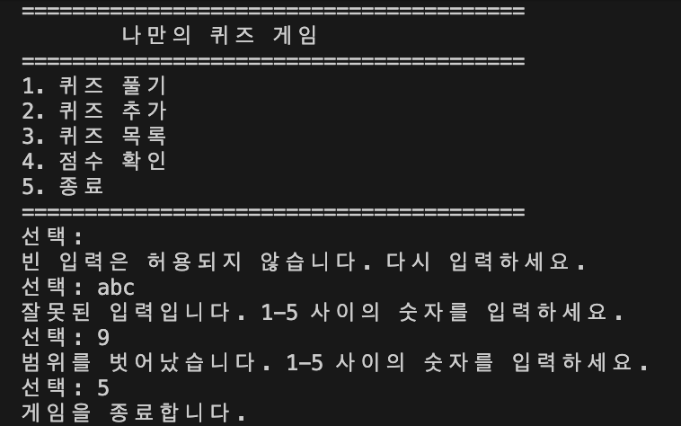

메뉴 입력 또는 퀴즈 입력 도중 `KeyboardInterrupt`, `EOFError`가 발생하면 현재 상태를 `state.json`에 저장한 뒤 안전하게 종료하도록 처리했다.

아래 스크린샷은 `Ctrl + C` 입력 시 traceback 없이 안전 종료되는 화면이다.

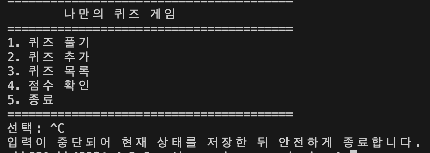

### 왜 `try/except`가 필요한가

이 프로젝트에서 `try/except`를 사용한 이유는 파일 입출력과 JSON 파싱이 항상 성공한다고 가정할 수 없기 때문이다.

예를 들어 아래 상황은 실제로 발생할 수 있다.

- `state.json` 파일이 존재하지 않는 첫 실행
- 사용자가 파일을 잘못 수정해서 JSON 문법이 깨진 경우
- 파일 읽기/쓰기 중 운영체제 수준 오류가 발생한 경우

이런 상황을 예외 처리 없이 구현하면 프로그램은 traceback을 출력하고 바로 종료될 수 있다.  
하지만 과제 요구사항은 **파일이 없거나 손상된 경우에도 프로그램이 실행 가능해야 한다**는 것이다.

그래서 이 프로젝트에서는 `try/except`를 아래 목적에 사용했다.

1. JSON 읽기 실패를 감지한다.
2. 실패 원인을 사용자에게 안내한다.
3. 기본 퀴즈 데이터로 상태를 복구한다.
4. 복구된 상태를 다시 `state.json`에 저장한다.
5. 프로그램은 종료하지 않고 계속 실행한다.

즉, `try/except`는 단순히 오류를 숨기기 위한 문법이 아니라,  
**실패 가능한 파일 작업을 프로그램 전체 흐름이 견딜 수 있게 만드는 복구 장치**로 사용했다.

---

## 11. 검증 방법

| 항목 | 검증 방법 | 결과 | 근거 |
|---|---|---|---|
| 메뉴 출력 | `python3 main.py` 실행 | 정상 출력 | `menu.png` |
| 퀴즈 추가 | 메뉴 2번 선택 후 문제/선택지/정답 입력 | 저장 후 목록 반영 확인 | `add-quiz.png`, `quiz-list.png` |
| 퀴즈 목록 | 메뉴 3번 선택 | 등록된 질문 목록 출력 확인 | `quiz-list.png` |
| 퀴즈 플레이 | 메뉴 1번 선택 후 정답 입력 | 정답/오답/최종 결과 출력 확인 | `play-quiz.png` |
| 최고 점수 확인 | 메뉴 4번 선택 | 최고 점수 출력 확인 | `best-score.png` |
| 데이터 유지 | 종료 후 재실행 | 추가 퀴즈와 최고 점수 유지 확인 | `persistence-check.png` |
| 파일 누락 복구 | `rm -f state.json` 후 실행 | 기본 데이터로 복구 확인 | `state-file-missing-recover.png` |
| 파일 손상 복구 | `echo "{broken json" > state.json` 후 실행 | 복구 메시지 및 정상 실행 확인 | `state-file-corrupted-recover.png` |
| 입력 검증 | 빈 입력, 문자 입력, 범위 밖 숫자 입력 | 재입력 처리 확인 | `invalid-input-check.png` |
| 안전 종료 | 메뉴 입력 중 `Ctrl + C` | 저장 후 안전 종료 확인 | `safe-exit.png` |
| 문법 검사 | `python3 -m py_compile main.py quiz.py quiz_game.py` | 오류 없이 통과해야 함 | 로컬 실행 검증 |
| Git 브랜치 | `git checkout -b feature/play-quiz`, 병합 로그 확인 | 브랜치 생성/병합 기록 확인 | `git-log-graph.png` |
| Git clone/pull | `git clone`, `git pull origin main` | 복제/최신 반영 확인 | README 기록 및 터미널 로그 |

---

## 12. 실행 결과 스크린샷

### 메뉴 화면
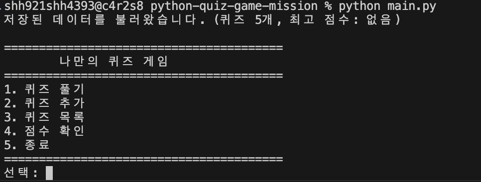

### 퀴즈 추가
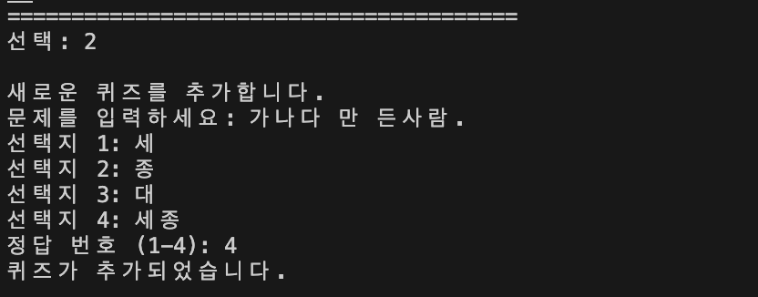

### 퀴즈 목록
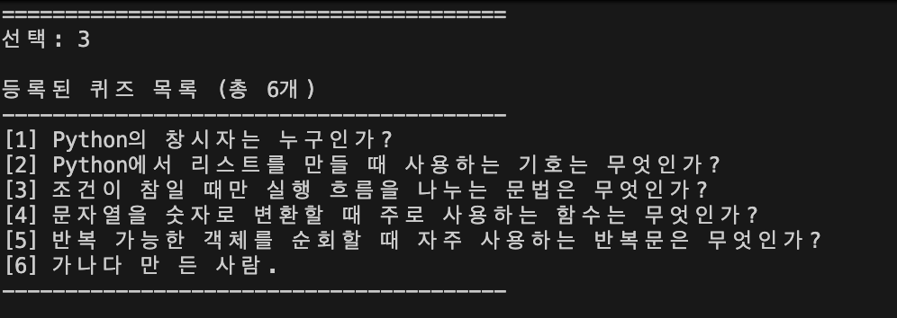

### 퀴즈 플레이 결과
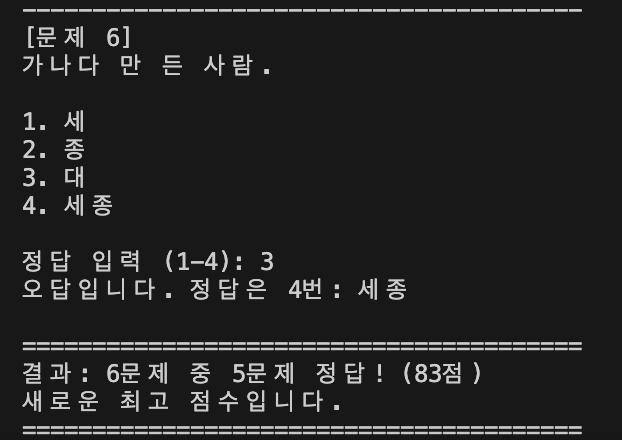

### 최고 점수 확인
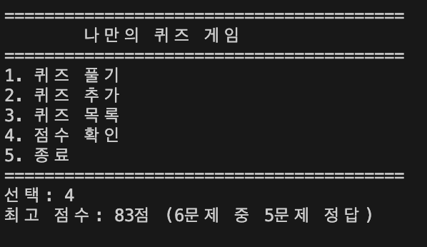

### 데이터 유지 확인


### 파일 누락 복구


### 파일 손상 복구


### 잘못된 입력 처리


### 안전 종료


### Git 로그 그래프
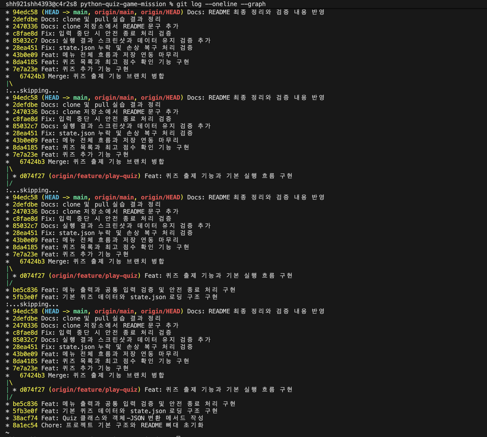

---

## 13. 트러블슈팅

### 문제 1. `state.json`이 없을 때 프로그램이 시작되지 않을 수 있었다

- 문제: 첫 실행 시 저장 파일이 없으면 상태 복구 단계에서 실패할 수 있다.
- 원인 가설: 파일 존재 여부를 먼저 검사하지 않고 바로 읽기를 시도하면 예외가 날 수 있다.
- 확인: `rm -f state.json` 후 `python3 main.py`를 실행해 파일 누락 상황을 직접 재현했다.
- 해결: 파일이 없으면 기본 퀴즈 데이터를 사용하고 즉시 `state.json`을 새로 저장하도록 처리했다.

### 문제 2. 손상된 JSON 때문에 상태 복구가 실패할 수 있었다

- 문제: `state.json`이 깨진 경우 `json.JSONDecodeError`로 로딩이 중단될 수 있다.
- 원인 가설: 사용자가 파일을 잘못 수정했거나 비정상 종료로 인해 JSON 구조가 깨질 수 있다.
- 확인: `echo "{broken json" > state.json` 후 실행하여 오류를 직접 재현했다.
- 해결: 예외를 잡아 안내 메시지를 출력하고 기본 퀴즈 데이터로 복구한 뒤 새 상태 파일을 다시 저장하도록 처리했다.

### 문제 3. 잘못된 입력이나 강제 중단으로 프로그램 흐름이 깨질 수 있었다

- 문제: 메뉴 입력에서 빈 값, 문자, 범위 밖 숫자가 들어오거나 `Ctrl + C`가 발생하면 흐름이 끊길 수 있다.
- 원인 가설: 입력값 검증과 중단 처리가 공통 메서드로 묶여 있지 않으면 프로그램이 쉽게 비정상 종료될 수 있다.
- 확인: 빈 입력, `abc`, `9`, `Ctrl + C`를 직접 입력해 재현했다.
- 해결: `read_int_in_range()`, `read_non_empty_text()`, `safe_exit()` 메서드로 공통 처리 로직을 분리해 안정적으로 재입력 또는 저장 후 종료되도록 구성했다.

---

## 14. Git 작업 기록

프로젝트 시작 직후 Git 저장소를 초기화하고 첫 커밋을 만들었다.

```zsh
git init
git add .
git commit -m "Chore: 프로젝트 기본 구조와 README 뼈대 초기화"
git branch
```

실행 결과:

```text
Initialized empty Git repository in /Users/shh921shh4393/dev/python-quiz-game-mission/.git/
[main (root-commit) 8a1ec54] Chore: 프로젝트 기본 구조와 README 뼈대 초기화
 6 files changed, 52 insertions(+)
 create mode 100644 .gitignore
 create mode 100644 README.md
 create mode 100644 main.py
 create mode 100644 quiz.py
 create mode 100644 quiz_game.py
 create mode 100644 state.json

* main
```

이후 GitHub 원격 저장소를 연결하고 첫 push를 완료했다.

```zsh
git remote add origin https://github.com/shannonlee-dev/python-quiz-game-mission.git
git push -u origin main
```

실행 결과:

```text
To https://github.com/shannonlee-dev/python-quiz-game-mission.git
 * [new branch]      main -> main
branch 'main' set up to track 'origin/main'.
```

퀴즈 출제 기능은 별도 브랜치에서 작업하기 위해 기능 브랜치를 생성했다.

```zsh
git checkout -b feature/play-quiz
git branch
```

실행 결과:

```text
Switched to a new branch 'feature/play-quiz'
* feature/play-quiz
  main
```

### `clone` 실습

```zsh
git clone https://github.com/shannonlee-dev/python-quiz-game-mission.git python-quizgame-mission-clone
pwd
ls -la
```

실행 결과:

```text
Cloning into 'python-quizgame-mission-clone'...
remote: Enumerating objects: 62, done.
remote: Counting objects: 100% (62/62), done.
remote: Compressing objects: 100% (39/39), done.
remote: Total 62 (delta 26), reused 54 (delta 18), pack-reused 0 (from 0)
Receiving objects: 100% (62/62), 374.64 KiB | 31.22 MiB/s, done.
Resolving deltas: 100% (26/26), done.

/Users/shh921shh4393/dev/python-quizgame-mission-clone

total 80
drwxr-xr-x  10 shh921shh4393  shh921shh4393    320 Mar 31 19:49 .
drwxr-xr-x   8 shh921shh4393  shh921shh4393    256 Mar 31 19:49 ..
drwxr-xr-x  12 shh921shh4393  shh921shh4393    384 Mar 31 19:49 .git
-rw-r--r--   1 shh921shh4393  shh921shh4393     30 Mar 31 19:49 .gitignore
drwxr-xr-x   3 shh921shh4393  shh921shh4393     96 Mar 31 19:49 docs
-rw-r--r--   1 shh921shh4393  shh921shh4393    556 Mar 31 19:49 main.py
-rw-r--r--   1 shh921shh4393  shh921shh4393   8661 Mar 31 19:49 quiz_game.py
-rw-r--r--   1 shh921shh4393  shh921shh4393    881 Mar 31 19:49 quiz.py
-rw-r--r--   1 shh921shh4393  shh921shh4393  11178 Mar 31 19:49 README.md
-rw-r--r--   1 shh921shh4393  shh921shh4393   1761 Mar 31 19:49 state.json
```

### `pull` 실습

```zsh
git pull origin main
tail -n 5 README.md
```

실행 결과:

```text
remote: Enumerating objects: 5, done.
remote: Counting objects: 100% (5/5), done.
remote: Compressing objects: 100% (1/1), done.
remote: Total 3 (delta 2), reused 3 (delta 2), pack-reused 0 (from 0)
Unpacking objects: 100% (3/3), 379 bytes | 126.00 KiB/s, done.
From https://github.com/shannonlee-dev/python-quiz-game-mission
 * branch            main       -> FETCH_HEAD
   c8fae8d..2470336  main       -> origin/main
Updating c8fae8d..2470336
Fast-forward
 README.md | 2 ++
 1 file changed, 2 insertions(+)

## 15. 저장소 링크
https://github.com/shannonlee-dev/python-quiz-game-mission

- clone 실습으로 추가한 문장입니다.
```

### Git 그래프 기록

아래 스크린샷은 `git log --oneline --graph --all` 결과를 캡처한 것이다.


### 커밋을 어떤 단위로 나누었는가

커밋은 **기능 단위**로 나누는 것을 기준으로 했다.  
한 커밋 안에 서로 다른 성격의 변경을 과하게 섞지 않으려 했다.

내가 잡은 기준은 아래와 같다.

- 프로젝트 초기 구조 생성
- `Quiz` 클래스 작성
- 기본 퀴즈 데이터 작성
- 메뉴 및 입력 검증 구현
- 퀴즈 출제 기능 구현
- 퀴즈 추가 기능 구현
- 퀴즈 목록 기능 구현
- 점수 확인 기능 구현
- `state.json` 저장/복구 기능 구현
- README 정리 및 스크린샷 반영

이렇게 나눈 이유는 커밋 하나가 **“무엇이 달라졌는지 한 문장으로 설명 가능한 최소 작업 단위”**가 되게 하기 위해서다.

예를 들어 퀴즈 출제 기능 커밋 안에는 플레이 흐름과 점수 계산처럼 같은 기능 묶음은 같이 들어갈 수 있지만,  
README 대량 수정이나 전혀 다른 저장 구조 변경까지 섞어 넣지는 않는 식으로 구분했다.

이렇게 하면 아래 장점이 있다.

1. `git log`만 봐도 개발 순서가 보인다.
2. 특정 기능에서 문제가 생겼을 때 어느 커밋을 먼저 봐야 할지 알기 쉽다.
3. 평가자 입장에서도 기능 단위 학습 흐름을 확인하기 쉽다.

### 커밋 메시지 규칙을 어떻게 정했는가

커밋 메시지는 **변경 성격 + 변경 요약** 구조로 정했다.

형식은 아래처럼 맞췄다.

- `Chore: ...`
- `Feat: ...`
- `Fix: ...`
- `Docs: ...`
- `Refactor: ...`

각 타입을 쓴 기준은 아래와 같다.

- `Chore`
  - 프로젝트 초기 설정, 뼈대 생성, 환경성 작업
- `Feat`
  - 사용자 기능 추가
  - 예: 메뉴, 퀴즈 출제, 퀴즈 추가, 목록, 점수
- `Fix`
  - 잘못된 동작 수정
  - 예: 저장 오류, 점수 갱신 문제, 복구 처리 보완
- `Docs`
  - README, 설명, 스크린샷, 제출 문서 정리
- `Refactor`
  - 기능은 유지하되 책임 분리나 구조 정리
  - 예: 입력 처리 공통 메서드 분리, 클래스 책임 정리

이 규칙을 정한 이유는 메시지만 봐도 **“이 커밋이 새 기능인지, 수정인지, 문서 변경인지”**가 바로 드러나게 하기 위해서다.

예를 들어 아래 메시지는 의도가 명확하다.

- `Feat: Quiz 클래스와 객체-JSON 변환 메서드 작성`
- `Feat: 메뉴 출력과 공통 입력 검증 및 안전 종료 처리 구현`
- `Fix: state.json 누락 및 손상 복구 처리 검증`
- `Docs: 실행 결과 스크린샷과 데이터 유지 검증 추가`

즉, 커밋 메시지 규칙은 단순 형식 맞추기가 아니라  
**변경 목적을 로그만으로 추적 가능하게 만드는 규칙**으로 잡았다.

### 브랜치를 분리한 이유

퀴즈 출제 기능은 `feature/play-quiz` 브랜치에서 따로 작업했다.  
브랜치를 분리한 이유는 메인 브랜치의 안정성을 유지한 채로, 하나의 기능을 독립적으로 구현하고 병합 기록까지 남기기 위해서다.

특히 이번 과제에서는 브랜치 생성과 병합 자체가 요구사항이기도 했기 때문에,  
단순히 기능만 구현하는 것이 아니라 **“새 기능을 main과 분리된 줄기에서 개발한 뒤, 완료 후 main에 합친다”**는 Git 흐름을 명시적으로 남기려고 했다.

---

## 15. 저장소 링크

GitHub Repository:  
`https://github.com/shannonlee-dev/python-quiz-game-mission`

- clone 실습으로 추가한 문장입니다.

---

## 16. 제출 전 최종 체크리스트

- [ ] Python 3.10 이상 환경에서 다시 검증했는가
- [ ] `python3 main.py` 실행 시 메뉴가 정상 출력되는가
- [ ] 퀴즈 풀기 / 추가 / 목록 / 점수 확인 / 종료 기능이 전부 동작하는가
- [ ] 종료 후 재실행해도 퀴즈와 최고 점수가 유지되는가
- [ ] `state.json` 누락 시 기본 데이터로 복구되는가
- [ ] 손상된 `state.json`에서도 프로그램이 정상 복구되는가
- [ ] 빈 입력 / 문자 입력 / 범위 밖 숫자 입력이 재입력 처리되는가
- [ ] `KeyboardInterrupt`, `EOFError` 발생 시 저장 후 안전 종료되는가
- [ ] `Quiz`, `QuizGame` 최소 2개 클래스가 존재하는가
- [ ] Git 커밋 수가 10개 이상인가
- [ ] 브랜치 생성 및 병합 기록이 남아 있는가
- [ ] `clone`, `pull` 실습 결과가 README에 기록되어 있는가
- [ ] GitHub 저장소 링크 하나로 README, 코드, 스크린샷, Git 기록을 확인할 수 있는가
- [ ] 민감정보가 과도하게 노출되지 않았는가
